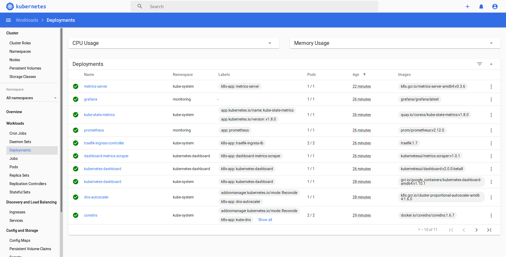
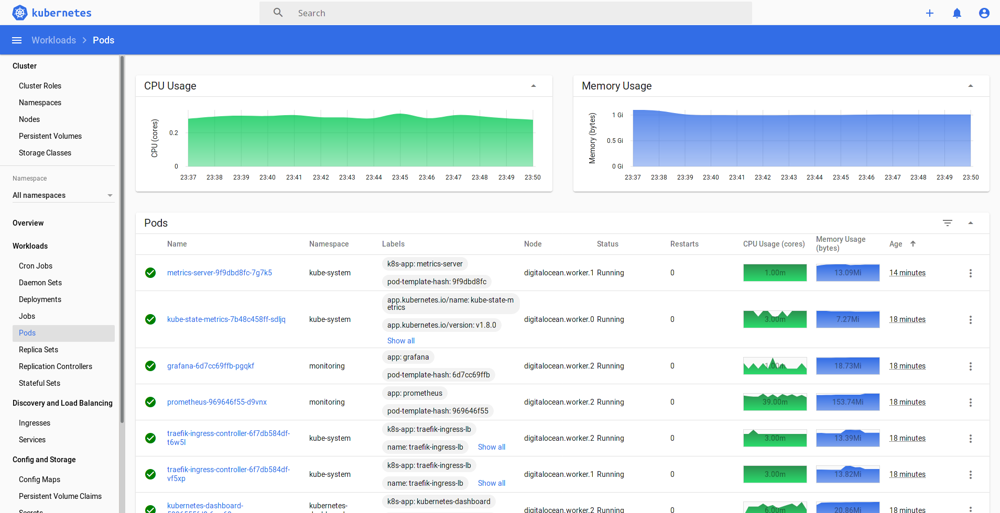
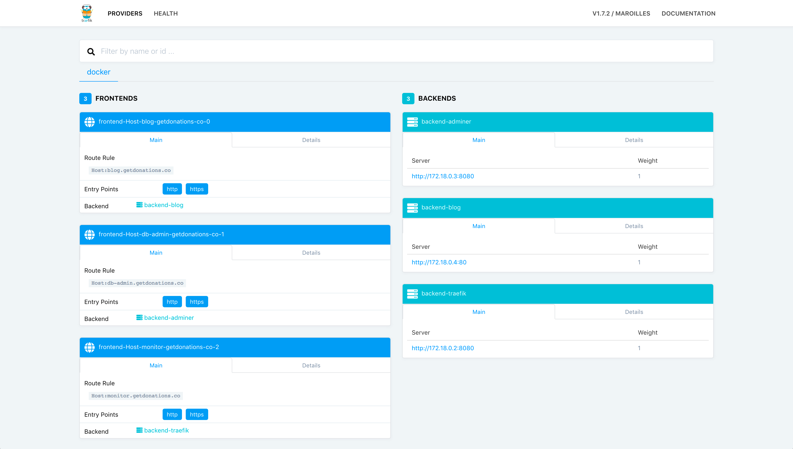
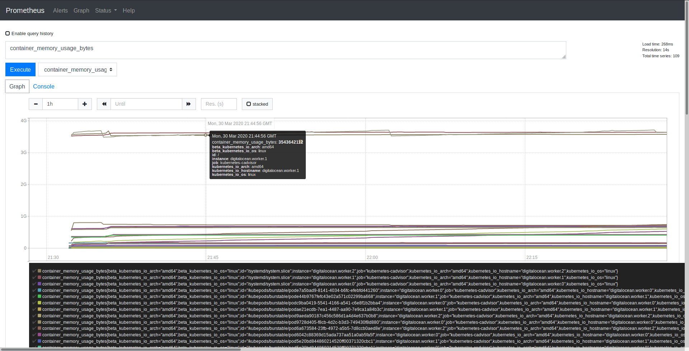
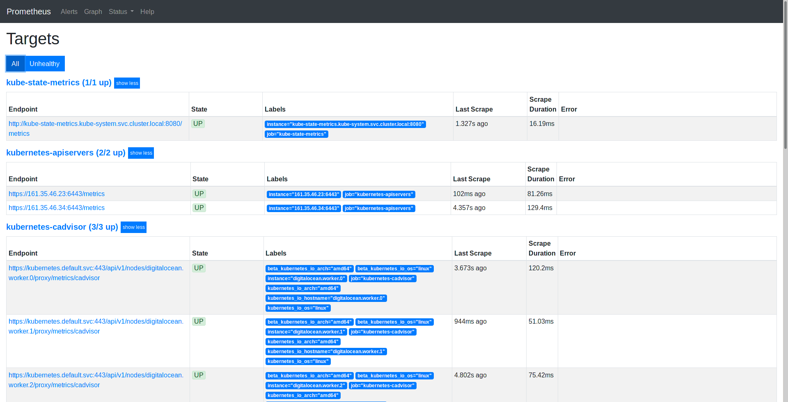
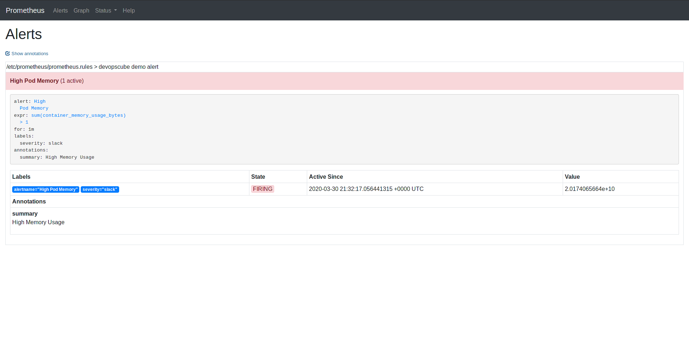
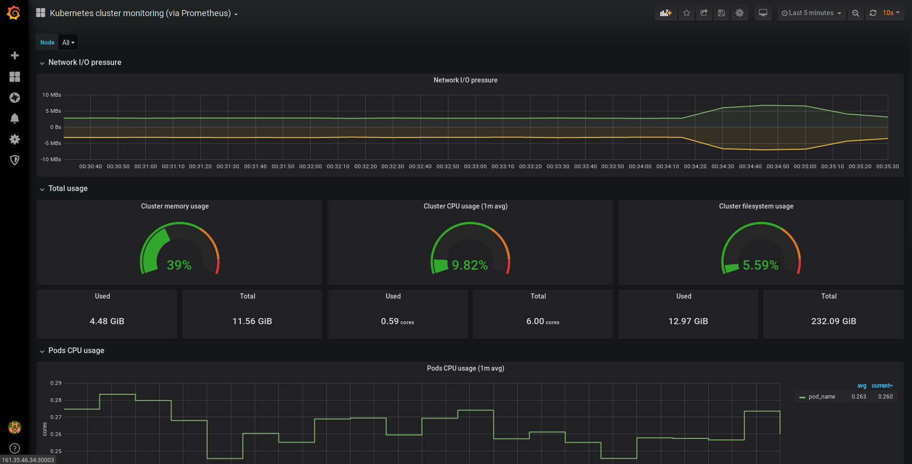

# Ops

> Monitor your ops cluster !

You now have a running cluster, let's start customizing it.

Finding the right configuration to install monitoring tools in your cluster can be really though. Do you have any idea of how many versions of metrics-server I tried to install before having my CPU load displayed onto my dashboard ? You don't want

Here, you will install multiple monitoring tools in your cluster, along with their services to reach their interface. Happy monitoring !

# Kubernetes Dashboard

A must have, the [Kubernetes admin dashboard](https://kubernetes.io/docs/tasks/access-application-cluster/web-ui-dashboard/) ! This web UI allow you to manage your cluster and monitor every activities of your baby.

It comes with an admin-user service account, which token will be saved at [my_cluster/admin-user-token](https://github.com/LeChatErrant/ops/tree/master/my_cluster/admin-user-token) to let you easily login into the dashboard

Kubernetes dashboard is exposed with a NodePort service on port 30000

> Access it with https://ANYNODEIP:30000

# Metrics Server

[Metrics server](https://github.com/kubernetes-sigs/metrics-server) is responsible for collecting resources metrics from kubeletes and exposing them in Kubernetes ApiServer through Metrics API.

It enables soom cool features, such as `kubectl top` command, HorizontalPodAutoscaler (HPA), VerticalPodAutoscaler (VPA), and allows Kubernetes dashboard to display those metrics directly

# Traefik

[Traefik](https://containo.us/traefik/) will be used as *ingress controller* in our cluster. Its purpose will be to load balance external traffic and to expose internal services to the world

It comes with a nice dashboard, allowing us to monitor incoming traffic

Traefik is exposed with a NodePort service on port 30001

> Access it with http://ANYNODEIP:30001

# Prometheus

[Prometheus] is one of the most popular and complete monitoring system. It will dynamically discover your components, scrap and aggregate their metrics.

Additionally, Prometheus let you define alert rules, which will fire in specific cases, and will be connected with AlerManager

Prometheus is exposed with a NodePort service on port 30002

> Access it with http://ANYNODEIP:30002

# Grafana

Here come the most amazing dashboard :[Grafana](https://grafana.com/) !

Grafana is an open source monitoring interface, the most popular when it comes to monitor metrics servers by tools like Prometheus

It will be your main monitoring interface. As it is totally customizable, you're here free to create your own layout, to chose what to display, and how to display it. You can try out pre-existing open-source configurations too (#ID 315 is a nice one to begin)

Grafana is exposed with a NodePort service on port 30003

> Access it with http://ANYNODEIP:30003

# AlertManager

> Coming soon!

### Contributors

 &nbsp; [LeChatErrant](https://github.com/LeChatErrant) - creator and maintainer
